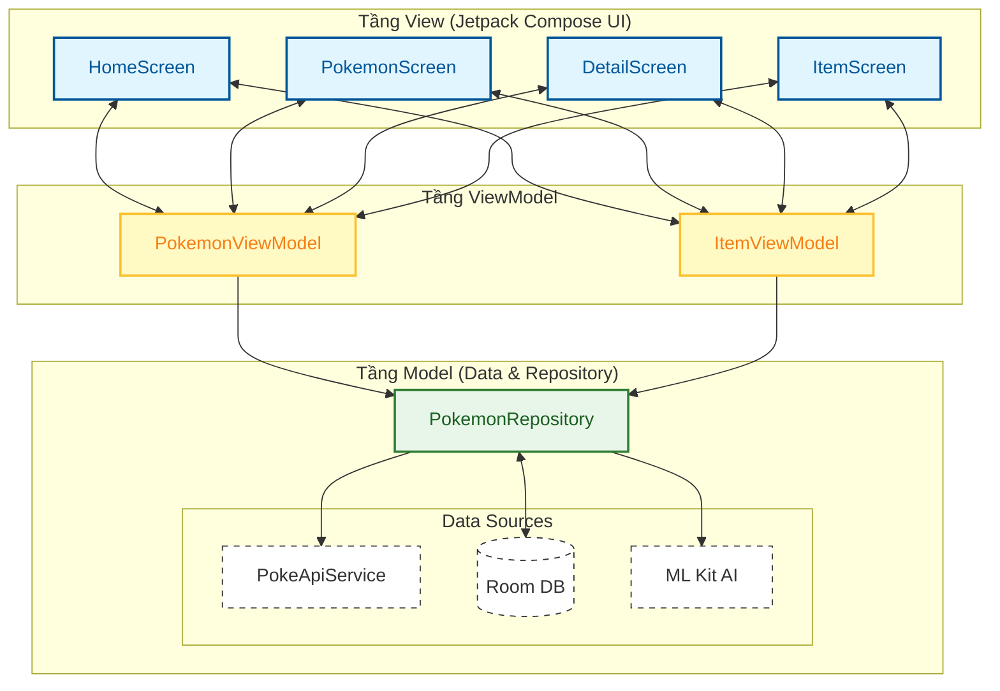
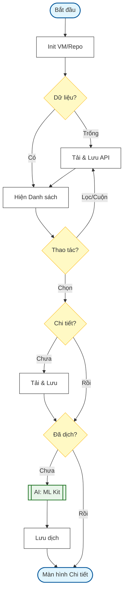
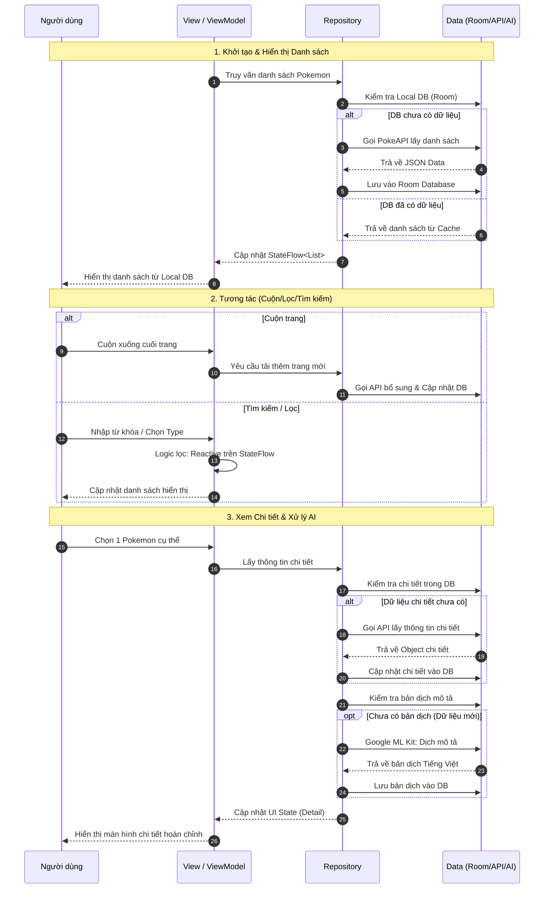

# Pokedex App Architecture Overview

Dự án được thiết kế theo kiến trúc chuẩn **MVVM (Model-View-ViewModel)** nhằm đảm bảo tính mở rộng, dễ bảo trì và tối ưu hiệu năng cho báo cáo kỹ thuật.

## 1. Sơ đồ kiến trúc hệ thống (Báo cáo)

## 2. Tài liệu thiết kế luồng (Diagrams)

### 2.1. Sơ đồ luồng hoạt động (Activity Diagram)
Sơ đồ mô tả logic xử lý dữ liệu và AI với bố cục tối ưu: Chữ to rõ nét, các bước được nén gọn để vừa vặn trong khung hình báo cáo mà không cần phóng to/thu nhỏ.

### 2.2. Sơ đồ tuần tự (Sequence Diagram)
Mô tả quy trình tương tác chi tiết giữa các thành phần, giữ phong cách "Ảnh 1" nhưng bổ sung đầy đủ logic như "Ảnh 2".

## 3. Giải thích thành phần chính
- **Offline-First**: Ứng dụng luôn ưu tiên hiển thị dữ liệu từ Room DB để đảm bảo tốc độ.
- **AI Engine**: Sử dụng Google ML Kit để dịch thuật mô tả Pokemon hoàn toàn tự động.
- **Reactive UI**: Sử dụng StateFlow để cập nhật giao diện ngay khi dữ liệu thay đổi.
